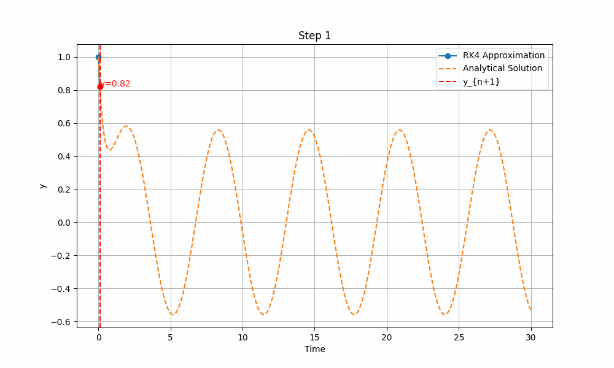

# Tutorials
Para utiiazr las funciones, mostraremos el siguiente ejemplo:

	#Establecemos la variable compleja y el operador que se necesita
	iConst = 1.0j
	oOper = np.array([[0, 1], [1, 0]])

	#Definimimos el estado inicial establecido por el problema.
	yInit = np.array([[1, 0], [0, 0]])

	#Necesitamos crear un arreglo de valores temporales por medio del uso de np.linspace, además creamos la variable que nos muestra el paso del tiempo.
	times=np.linspace(0,10,150)
	h= times[1]-times[0]

	#Vamos a establecer los arreglos que van a empezar en 0.
	stateQuant00 = np.zeros(times.size)
	stateQuant11 = np.zeros(times.size)

	#En la siguiente función se muestra la evolución temporal:
	for tt in range(times.size):

   	 # Utilizamos el valor de las entradas (0,0) y (1,1). 
   	 stateQuant00[tt] = np.real(yInit[0,0]) 
    	 stateQuant11[tt] = np.real(yInit[1,1])
    
	# Se utiliza la función  rk4 operando sobre yInit y obtenemos el resultado.
   	 yN = rk4(dyn_generator, oOper, yInit, h)
   	
 	# Asignamos yN a yInit para que el operador se vaya iterando.
	 yInit = yN

Por último, realizamos la graficación de los puntos obtenidos en cada iteración, utilizando la herramienta matplot.lib:
	#plt.plot(times,stateQuant00) plt.plot(times,stateQuant11)

	#plt.show()
En la imagen de abajo, encontramos una representación del comportamiento del método de Runge-Kutta.
	
